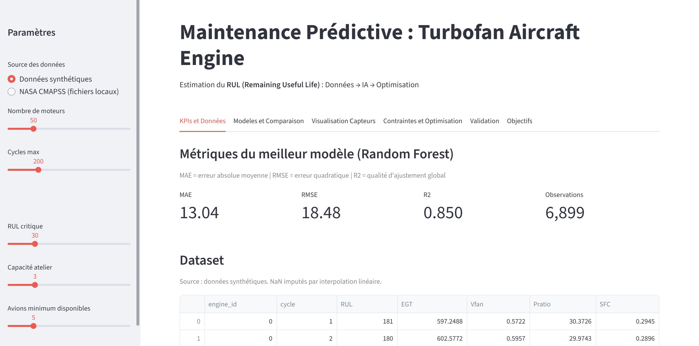
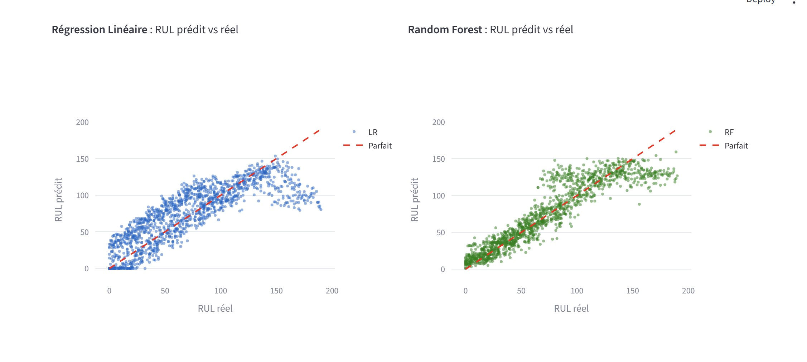
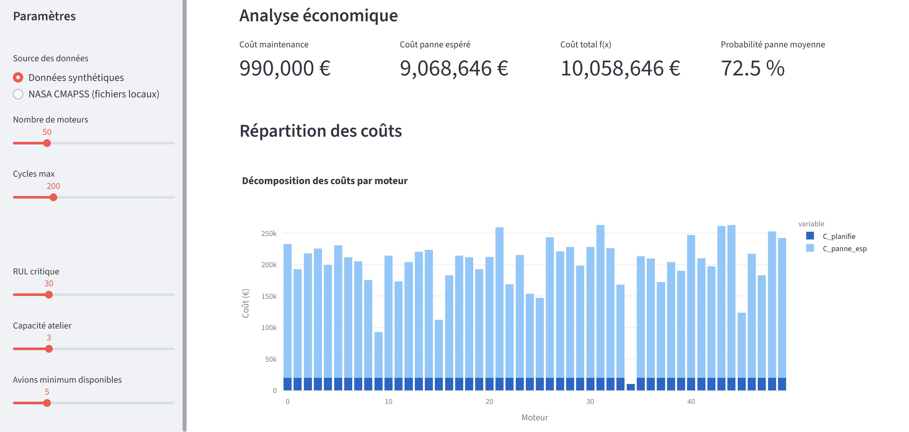

# Projet Adell - Rigaud - Belaidi - Hassaine
<br><br>

# Visualisation en ligne


<br><br>

# Visualisation en local
1 - Téléchager les fichiers dans un dossier  <br>
2 - Ouvrer le dossier dans votre éditeur python

<br>

## Installer les librairies
3 - Dans votre terminal :
```
pip install -r requirements.txt
```

```
streamlit run app.py
```
<br>

## Cliquez sur l'URL Local
```
  You can now view your Streamlit app in your browser.

  Local URL: http://localhost:XXXX
  Network URL: http://XX.XXX.XXX.XXX:XXXX
```
<br>




